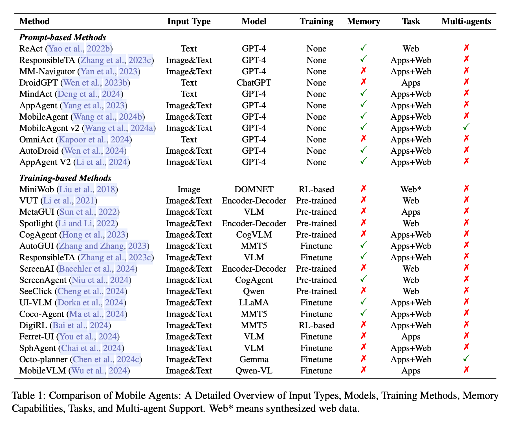
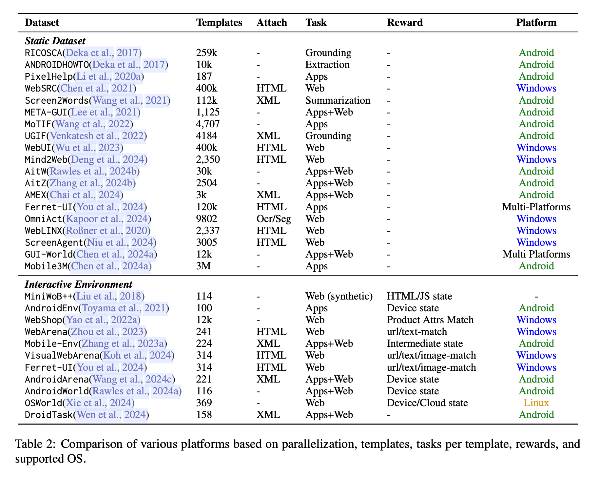

# Recent Trends in Multimodal Mobile Agents: A Survey
 





% Unimodal MOBILE AGENTS
% Multimodal MOBILE AGENTS 

## Base Model

- CogVLM: Visual Expert for Pretrained Language Models
- MiniCPM
- LLaVA-NeXT
- LLaVA-OneVision: Easy Visual Task Transfer
- SeeClick: Harnessing GUI Grounding for Advanced Visual GUI Agents (ACL2024)


## Prompt Based Framework


- AppAgent: Multimodal Agents as Smartphone Users
- Mobile-Agent: Autonomous Multi-Modal Mobile Device Agent with Visual Perception
- UFO: A UI-Focused Agent for Windows OS Interaction
- OS-Copilot: Towards Generalist Computer Agents with Self-Improvement
- MMAC-Copilot: Multi-modal Agent Collaboration Operating System Copilot


## LLM-SFT Based Framework
- CogAgent: A Visual Language Model for GUI Agents
- ScreenAI: A Vision-Language Model for UI and Infographics Understanding
- TRAINING A VISION LANGUAGE MODEL AS SMARTPHONE ASSISTANT (ICLR 2024)
- AGENTOHANA: Designing a Unified Data and Training Pipeline for Effective Agent Learning


## LLM-RL Based Framework

- Vision-Language Models as Decision-Making Agents
- DigiRL: Training In-The-Wild Device-Control Agents with Autonomous Reinforcement (NIPS2024)

**UI understanding and Automation**


- UIED: a hybrid tool for GUI element detection
- Object Detection for Graphical User Interface: Old Fashioned or Deep Learning or a Combination?
- AutoDroid: LLM-powered Task Automation in Android  CHI 2024
- Spotlight: Mobile UI Understanding using Vision-Language Models with a Focus    ICLR 2023
- VUT: Versatile UI Transformer for Multimodal Multi-Task User Interface Modeling    ICLR 2022
- Widget Captioning: Generating Natural Language Description for Mobile User Interface Elements    EMNLP 2020
- Screen Recognition: Creating Accessibility Metadata for Mobile Applications from Pixels       CHI 2021
- Enabling Conversational Interaction with Mobile UI Using Large Language Models     CHI 2023
- Screen2Words: Automatic Mobile UI Summarization with Multimodal Learning    UIST 2021
- Kite: Building Conversational Bots from Mobile Apps    Mobisys 2018
- META-GUI: Towards Multi-modal Conversational Agents on Mobile GUI
- DroidBot-GPT: GPT-powered UI Automation for Android
- Responsible Task Automation: Empowering Large Language Models as Responsible Task Automation
- Personal LLM Agents: Insights and Survey about the Capability, Efficiency and Security
- MMAC-Copilot: Multi-modal Agent Collaboration Operating System Copilot


## Dataset and Benchmark

### 2017
- Scaling Instructable Agents Across Many Simulated Worlds (2017)

### 2022
- MiniWoB++ / Success Rate (2022)

### 2023
- MoTIF: A Dataset for Interactive Vision-Language Navigation with Unknown Command Feasibility (2023)
- IND2WEB: Towards a Generalist Agent for the Web (2023)
- WebArena: A Realistic Web Environment for Building Autonomous Agents (2023)


 
### 2024
- Android in the Wild: A Large-Scale Dataset for Android Device Control (2024)
- ANDROIDWORLD / Success Rate
- OSWORLD: Benchmarking Multimodal Agents for Open-Ended Tasks in Real Computer Environments / Success Rate
- Screen Agent (ACL2024)
- OmniACT: A Dataset and Benchmark for Enabling Multimodal Generalist Autonomous Agents for Desktop and Web / Sequence score
- Ferret-UI: Grounded Mobile UI Understanding with Multimodal LLMs
- AutoUI: You Only Look at Screens: Multimodal Chain-of-Action Agents (ACL2024)
- GUI-WORLD: A Dataset for GUI-oriented Multimodal LLM-based Agents

- Octo-planner: On-device Language Model for Planner-Action Agents
- AppWorld: A Controllable World of Apps and People for Benchmarking Interactive Coding Agents (ACL2024)
- Mobile-Bench: An Evaluation Benchmark for LLM-based Mobile Agents (ACL2024)
- VisualWebArena: Evaluating Multimodal Agents on Realistic Visually Grounded Web Tasks (ACL2024)
- WebCanvas: Benchmarking Web Agents in Online Environments
- MobileAgentBench: An Efficient and User-Friendly Benchmark for Mobile LLM Agents
- GUICourse: From General Vision Language Model to Versatile GUI Agent
- CoCo-Agent: A Comprehensive Cognitive MLLM Agent for Smartphone GUI Automation

  

## To-Do List
- Mobile-Agent: Autonomous Multi-Modal Mobile Device Agent with Visual Perception http://arxiv.org/abs/2401.16158
- UFO: A UI-Focused Agent for Windows OS Interaction http://arxiv.org/abs/2402.07939
- ScreenAI: A Vision-Language Model for UI and Infographics Understanding http://arxiv.org/abs/2402.04615
- AppAgent: Multimodal Agents as Smartphone Users http://arxiv.org/abs/2312.13771
- CogAgent: A Visual Language Model for GUI Agents http://arxiv.org/abs/2312.08914
- Screen2Words: Automatic Mobile UI Summarization with Multimodal Learning http://arxiv.org/abs/2108.03353
- A Real-World WebAgent with Planning, Long Context Understanding, and Program Synthesis http://arxiv.org/abs/2307.12856
- Comprehensive Cognitive LLM Agent for Smartphone GUI Automation http://arxiv.org/abs/2402.11941
- Towards General Computer Control: A Multimodal Agent for Red Dead Redemption II as a Case Study https://arxiv.org/abs/2403.03186
- Scaling Instructable Agents Across Many Simulated Worlds [link to technical report](https://storage.googleapis.com/deepmind-media/DeepMind.com/Blog/sima-generalist-ai-agent-for-3d-virtual-environments/Scaling%20Instructable%20Agents%20Across%20Many%20Simulated%20Worlds.pdf)
- Android in the Zoo: Chain-of-Action-Thought for GUI Agents http://arxiv.org/abs/2403.02713
- OmniACT: A Dataset and Benchmark for Enabling Multimodal Generalist Autonomous Agents for Desktop and Web http://arxiv.org/abs/2402.17553
- Comprehensive Cognitive LLM Agent for Smartphone GUI Automation http://arxiv.org/abs/2402.11941
- Improving Language Understanding from Screenshots http://arxiv.org/abs/2402.14073
- AndroidEnv: A Reinforcement Learning Platform for Android http://arxiv.org/abs/2105.13231
- SeeClick: Harnessing GUI Grounding for Advanced Visual GUI Agents https://arxiv.org/abs/2401.10935
- AgentStudio: A Toolkit for Building General Virtual Agents https://arxiv.org/abs/2403.17918
- ReALM: Reference Resolution As Language Modeling https://arxiv.org/abs/2403.20329
- AutoWebGLM: Bootstrap And Reinforce A Large Language Model-based Web Navigating Agent https://arxiv.org/abs/2404.03648
- Octopus v2: On-device language model for super agent https://arxiv.org/pdf/2404.01744.pdf
- Mobile-Env: An Evaluation Platform and Benchmark for LLM-GUI Interaction https://arxiv.org/abs/2305.08144
- OSWorld: Benchmarking Multimodal Agents for Open-Ended Tasks in Real Computer Environments https://arxiv.org/abs/2404.07972
- Ferret-UI: Grounded Mobile UI Understanding with Multimodal LLMs https://arxiv.org/abs/2404.05719
- VisualWebBench: How Far Have Multimodal LLMs Evolved in Web Page Understanding and Grounding? https://arxiv.org/abs/2404.05955
- OS-Copilot: Towards Generalist Computer Agents with Self-Improvement https://arxiv.org/abs/2402.07456
- VisualWebBench: How Far Have Multimodal LLMs Evolved in Web Page Understanding and Grounding? https://arxiv.org/abs/2404.05955
- AutoDroid: LLM-powered Task Automation in Android https://arxiv.org/abs/2308.15272
- Fine-Tuning Large Vision-Language Models as Decision-Making Agents via Reinforcement Learning https://rl4vlm.github.io
- WebArena: A Realistic Web Environment for Building Autonomous Agents https://arxiv.org/abs/2307.13854
- Synapse: Trajectory-as-Exemplar Prompting with Memory for Computer Control https://openreview.net/pdf?id=Pc8AU1aF5e
- gpt-computer-assistant https://github.com/onuratakan/gpt-computer-assistant
- Mobile-Agent: The Powerful Mobile Device Operation Assistant Family https://github.com/X-PLUG/MobileAgent
- GUI Odyssey: A Comprehensive Dataset for Cross-App GUI Navigation on Mobile Devices https://github.com/OpenGVLab/GUI-Odyssey
- ASSISTGUI: Task-Oriented PC Graphical User Interface Automation https://showlab.github.io/assistgui/
- You Only Look at Screens: Multimodal Chain-of-Action Agents https://arxiv.org/abs/2309.11436 https://github.com/cooelf/Auto-GUI
- E-ANT: A Large-Scale Dataset for Efficient Automatic GUI NavigaTion https://arxiv.org/pdf/2406.14250
- AndroidWorld https://github.com/google-research/android_world
- AppWorld: A Controllable World of Apps and People for Benchmarking Interactive Coding Agents https://arxiv.org/abs/2407.18901 https://appworld.dev/
- Read Anywhere Pointed: Layout-aware GUI Screen Reading with Tree-of-Lens Grounding https://arxiv.org/abs/2406.19263
- Cradle: Empowering Foundation Agents Towards General Computer Control https://arxiv.org/abs/2403.03186
- Tree Search for Language Model Agents https://arxiv.org/abs/2407.01476
- LaVague: Web Agent framework for builders https://github.com/lavague-ai/LaVague
- WebLlama: https://github.com/McGill-NLP/webllama
- AutoCrawler: A Progressive Understanding Web Agent for Web Crawler Generation https://arxiv.org/abs/2404.12753

- WebVoyager: Building an End-to-End Web Agent with Large Multimodal Models (ACL2024)
- Tuning Large Multimodal Models for Videos using Reinforcement Learning from AI Feedback (ACL2024)


# Citation

```bib
@article{wu2024curriculum,
  title={Curriculum Learning with Quality-Driven Data Selection},
  author={Wu, Biao and Meng, Fang and Chen, Ling},
  journal={arXiv preprint arXiv:2407.00102},
  year={2024}
}
```


--- 

## Star History

<a href="https://github.com/White65534/Awesome-Mobile-Agent&Date">
 <picture>
   <source media="(prefers-color-scheme: dark)" srcset="https://api.star-history.com/svg?repos=aialt/awesome-mobile-agents&type=Date&theme=dark" />
   <source media="(prefers-color-scheme: light)" srcset="https://api.star-history.com/svg?repos=aialt/awesome-mobile-agents&type=Date" />
   
 </picture>
</a>
